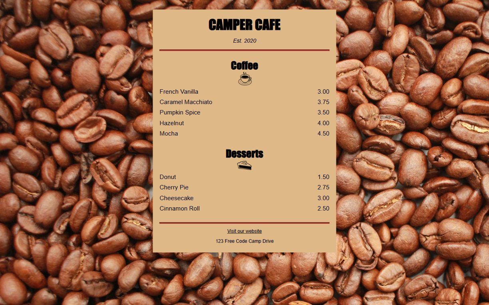

# Colored Markers | FCC Responsive Web Design Certification

**Project 3/20**

A simple and colorful CSS project that displays red, green, and blue markers using gradients, shadows, and various color models. It showcases how to create visual effects with only HTML and CSS.

---

## 📚 Table of Contents

- [🔎 Overview](#-overview)
  - [📸 Screenshot](#-screenshot)
  - [🔗 Links](#-links)
  - [📌 Features](#-features)
- [🧠 My process](#-my-process)
  - [🛠️ Built with](#️-built-with)
  - [🎓 What I learned](#-what-i-learned)
  - [🔙 Previous Project](#-previous-project)
  - [🔜 Next Project](#-next-project)
- [👤 Author](#-author)
  - [🌐 Connect with Me](#-connect-with-me)
  - [💻 Coding Profiles](#-coding-profiles)

---

## 🔎 Overview

### 📸 Screenshot

### 🔗 Links

 - [🔴 Live Demo](https://dalascript.github.io/colored-markers/)
 - [🗂️ GitHub Repository](https://github.com/DalaScript/colored-markers)

### 📌 Features

 - ✅ Pure HTML structure
 - ✅ Custom CSS styling
 - ✅ Clean, reusable structure
 - ✅ Centered and minimal layout

## 🧠 My Process

### 🛠️ Built with

 - HTML5
 - CSS3

### 🎓 What I Learned

  > 🚀 For me, this project was more about **practice** and gaining additional **experience**,  
  > rather than learning something entirely new.  
  >  
  > 👨‍💻 Since I’m not a beginner and already familiar with these technologies,  
  > I approached it with confidence — and still, I truly **enjoyed working on it**.  
  >  
  > 🎯 Overall, I consider this a very **valuable and enjoyable experience**.

### 🔙 Previous Project

 - Cafe Menu | *[Project 2/20]* → [View Repository](https://github.com/DalaScript/cafe-menu)

### 🔜 Next Project

 - Registration Form | *[Project 4/20]* → [View Repository](https://github.com/DalaScript/registration-form)

---

## 👤 Author

### 🌐 Connect with Me

 - [Instagram](https://www.instagram.com/DalaScript)
 - [YouTube](https://www.youtube.com/@DalaScript)

### 💻 Coding Profiles

 - [freeCodeCamp](https://www.freecodecamp.org/DalaScript)
 - [FrontendMentor](https://www.frontendmentor.io/profile/DalaScript)
 - [GitHub](https://github.com/DalaScript)

*🙌 Thanks for checking out my project! More coming soon. Stay tuned 🚀*